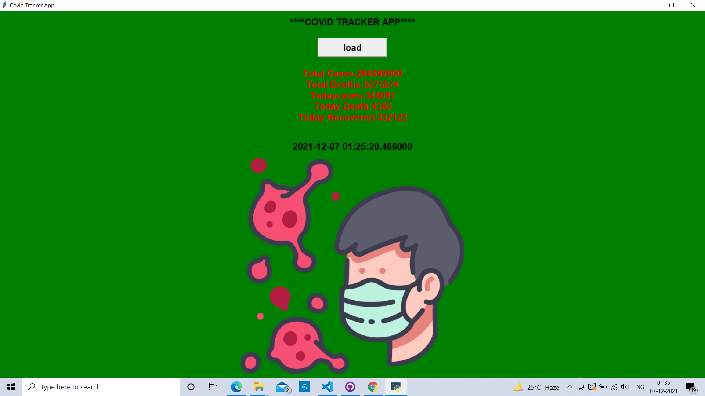
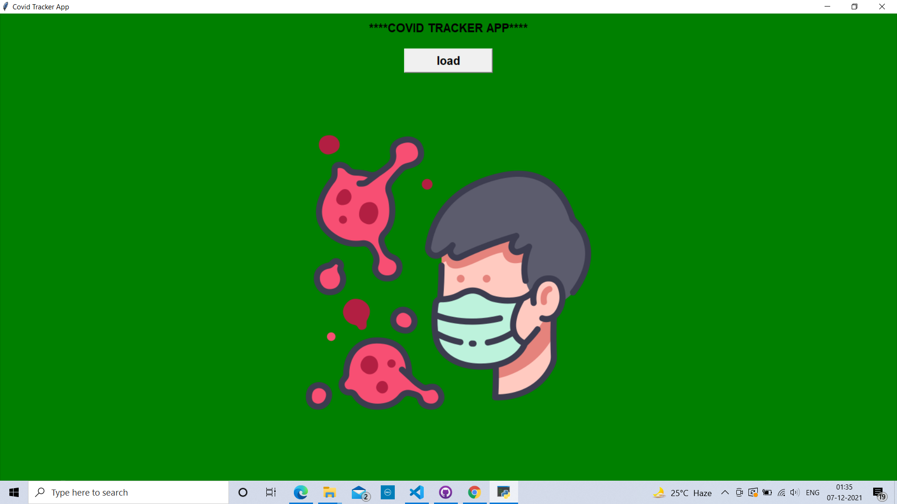

## COVID TRACKER APP GUI
 
<h2> What is python GUI :</h2> 
  

Python offers multiple options for developing GUI (Graphical User Interface). ... It is a standard Python interface to the Tk GUI toolkit shipped with Python. Python with tkinter is the fastest and easiest way to create the GUI applications. Creating a GUI using tkinter is an easy task.

 
  

<h2> About this project : </h2>
  

Covid Tracker App GUI made by fetching api and using Tkinter module in python.
This app uses information from API and gives details about today's cases, today's death, today's recovered cases, total cases and total deaths. It also features the updated time, it can be reloaded in 1 min for updated informations.

  

## 📌 Tech Stack:
  
[]
[]
  

## 📌 Main Page:
  
<h2>BEFORE CLICKING ON LOAD</h2>
  

  
<h2>AFTER CLICKING ON LOAD</h2>
  

  

<h2>📌 Contact :</h2>
  

<a href="mailto:shrutidmishra2002@gmail.com">

 

© 2021 Shruti Mishra 
